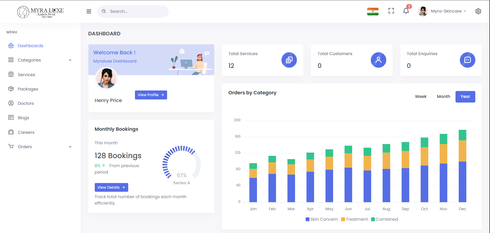

# 🌿 Myra Skincare Insight & Showcase Platform

A modern, lightweight Laravel-based web application designed to explore, review, and showcase **Myra Luxe Skincare** products. This platform helps users make informed choices about **vitamin-infused skincare** using dynamic filtering, category organization, and admin-level management.

---

## 📝 Table of Contents

- [Features](#-features)
- [Tech Stack](#-tech-stack)
- [Screenshots](#-screenshots)
- [Installation](#-installation)
- [Usage](#-usage)
- [Admin Functionalities](#-admin-functionalities)
- [Future Improvements](#-future-improvements)
- [Contributors](#-contributors)
- [License](#-license)

---

## ✨ Features

- 💄 Browse and filter **Myra Skincare** services by gender, category, and sub-category.
- 🧴 View detailed product/service pages with highlights, videos, how-it-works sections, and FAQs.
- 🧑‍💼 Admin dashboard to manage:
  - Services
  - Categories (Gender → Top Category → Mid Category)
  - Image/video uploads
- 📝 Blog/News section to engage visitors with skincare updates.
- ⚙️ AJAX-powered category filtering without page reload.
- 📊 Dynamic dropdowns based on user selections.
- 📁 Upload & manage images/videos directly from the panel.
- 🌐 Mobile-responsive modern UI.

---

## 🛠 Tech Stack

| Layer        | Technology                             |
|--------------|-----------------------------------------|
| Backend      | Laravel 10.x (MVC)                      |
| Frontend     | Blade, Bootstrap 5, HTML, CSS, JS       |
| Database     | MySQL / MariaDB                         |
| JS Features  | jQuery (AJAX), Dynamic Select Dropdowns |
| Media Upload | Laravel Filesystem (public disk)        |
| Other Tools  | Git, GitHub, VS Code, XAMPP             |

---

## 🖼 Screenshots

| Home Page            | Admin Panel Services             |
|----------------------|----------------------------------|
|  |  |


---

## ⚙️ Installation

```bash
# Step 1: Clone the repository
git clone https://github.com/Vishal-Patel2/Myra-skincare.git
cd Myra-skincare

# Step 2: Install dependencies
composer install

# Step 3: Copy .env and set up database
cp .env.example .env
php artisan key:generate

# Step 4: Configure .env database section
DB_DATABASE=myra_db
DB_USERNAME=root
DB_PASSWORD=

# Step 5: Migrate database and seed (if seeds available)
php artisan migrate

# Step 6: Run local server
php artisan serve

```
## 🚀 Usage

- Visit the homepage to explore Myra Luxe skincare services.
- Use filters for gender, top category, and mid category to narrow results.
- Access the admin panel at `/admin` to manage content dynamically.

---

## 🛡 Admin Functionalities

- CRUD operations for services and categories.
- Upload images/videos per service.
- Manage blog/news posts (if enabled).
- Auto-filter dropdowns via AJAX.

---

## 🔮 Future Improvements

- 🔐 Authentication for admin routes.
- 🔍 Live search and autocomplete.
- 📝 Full blog CMS with tags and comments.
- 📞 Contact/booking form with WhatsApp integration.
- 🌍 Multi-language support.

---

## 👨‍💻 Contributors

- [Vishal Patel](https://github.com/Vishal-Patel2)
- Akash Jadli
